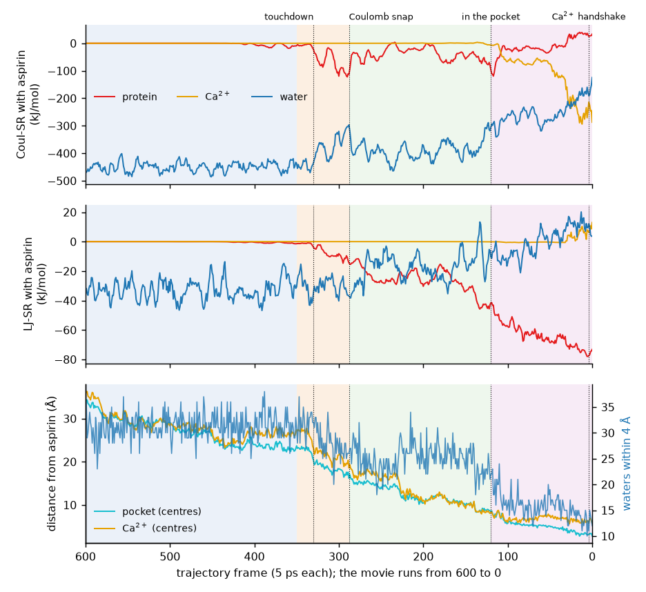
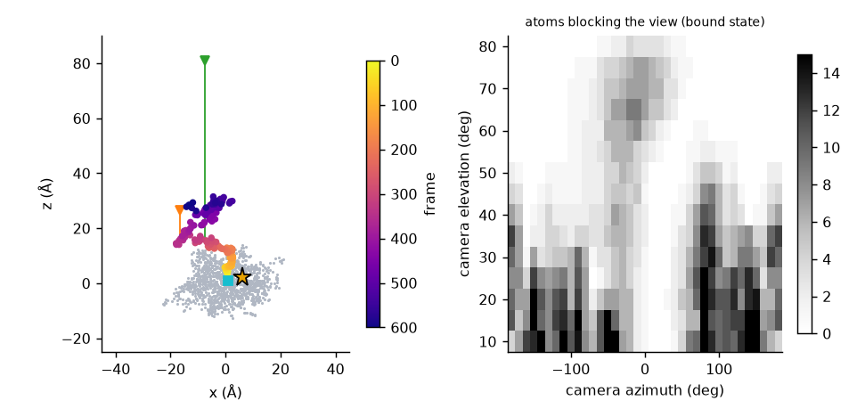
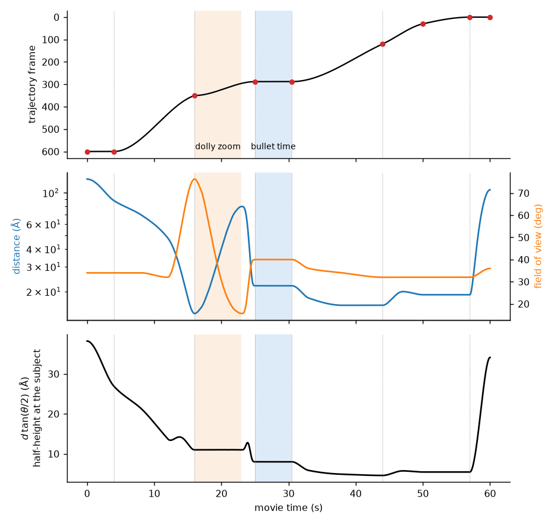
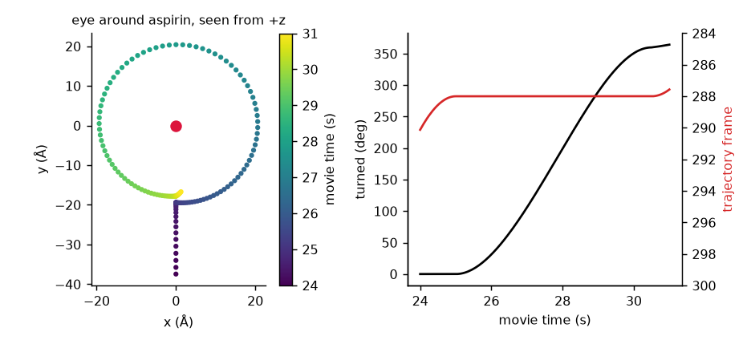
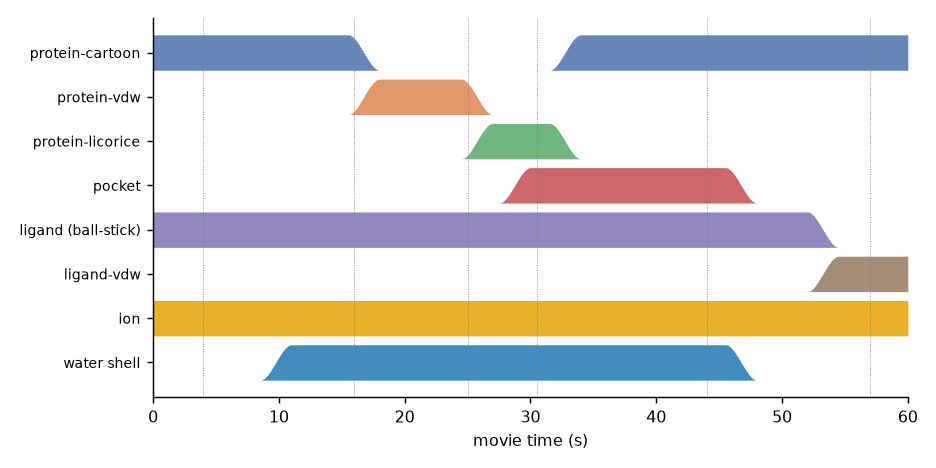

# Reading a molecular encounter with a virtual camera: how a short brief became a 60-second VIAMD movie of aspirin docking in phospholipase A2

**Prompt and review:** M. Linares **·** **Design and implementation:** GitHub Copilot (Claude Sonnet 5.5), working inside VS Code on the `video` branch of VIAMD

*Technical note, 8 October 2026. Files: `docs/examples/aspirin_binding_movie.via` and this text.*

---

## Abstract

A molecular dynamics (MD) trajectory is a table of coordinates and energies; a movie is an argument about it. We document how a short prompt, "produce a one-minute movie of the protein-aspirin example, with interesting geometries and energy terms, a dolly zoom and a Matrix-style bullet effect, with transitions between representations, tracking the protein, the aspirin, the water and the Ca$^{2+}$ ion, and focusing on LJ-SR and Coul-SR", was turned into a finished workspace for the movie maker of VIAMD. The work had four parts. First, the 601-frame, 3 ns trajectory and its energy file were analysed to find the events worth showing: a surface capture of aspirin by a lysine near frame 288 (Coul-SR with the protein reaches $-156$ kJ/mol), a descent into the pocket, and a Ca$^{2+}$ bridge that takes over at the end (Coul-SR with the ion reaches $-359$ kJ/mol). Second, the physics of those terms was examined: the sum of the six aspirin interaction terms stays within about 5% ($-484 \to -462$ kJ/mol) while water is traded for protein and calcium ($-484 \to -182$ and $0 \to -280$ kJ/mol). Third, each event was matched with a cinematic device chosen because it answers a question about the data: a dolly zoom at touchdown, a frozen-time orbit at the Coulomb minimum, slow motion at the calcium handshake. Fourth, the camera, trajectory-time schedule, representation hand-overs and overlays were specified as keys, verified numerically with VIAMD's own camera code, and written to a workspace file. We report the reasoning, the numbers behind each choice, the iterations that corrected the first design, and what was not verified. The movie has not been seen by its designer; it was judged by the person who prompted it.

**Keywords:** molecular visualization, molecular dynamics, electrostatics, Ca$^{2+}$ binding, phospholipase A2, computational cinematography, VIAMD.

---

## 1. Introduction

Interactive analysis tools such as VIAMD [1] are good at asking questions of a trajectory: how far is the ligand from the pocket, how many waters surround it, what does the energy file say. A movie asks a different question: *in what order should a viewer learn these things, and what should the camera make obvious?* The camera, the speed of the trajectory, the representations and the overlays are then four coordinated instruments. A dolly zoom and a bullet-time orbit are not decoration. Each is a device with a precise geometric meaning, and each is worth using only where that meaning fits the science.

This note records how such a movie was produced by prompting, not by hand editing. The aim is twofold. For the reader of the movie, it explains why aspirin is placed where it is in the frame, why representations change when they do, and why time stops at a particular frame. For the person who wants to prompt another movie, it records which pieces of the brief mattered and which decisions the brief left open.

We keep a strict line between what was measured and what was chosen. Section 3 and Section 4 are about the data. Sections 5 to 9 are about choices. Section 11 lists what was not verified.

## 2. The brief

### 2.1 The prompts

The task came in three messages, quoted verbatim.

> **P1.** "So. You have the protein-aspirin example. You can analyze the keypoints. I want you to produce a via file with a movie on your own. Please incorporate interesting properties like geometries or energy term. I want a dynamic movie of 1 min, Please incorporate effect such as the dolly zoom and the matrix bullet effect. Do you understand the task?"

> **P2.** "yes / yes be creative and incorporate transition btw representation. You will have to update the transition part of the via file / Well there is the protein, the aspirin, the water, and the CA ion to track. you should focus on lj-sr and coul-sr. / More questions?"

> **P3.** "I just watch your movie three times in row. It is amazing.  **I am shaking and I am a bit scared I must admit**. I want you to write now. Priority one to document the prompt I made and your reasoning based on that to arrive to this amazing movie. I want you to discuss the physics the choice of placement of the molecule, change of representations, the coulombic trap combined with the bullet effect. Explain in the style of a 10 pages arxiv article."

The first two messages are the specification. The third requests this document. Between P1 and P2 the assistant asked three questions (where to put the file, whether to include a title and end card, which energy terms); P2 answers them: new file, yes, and the four species and two energy families.

### 2.2 From sentences to requirements

A brief written for a person leaves many things unsaid. We turned it into explicit requirements, and kept the link between each requirement and its realisation.

| ID | Source | Requirement | Realised as |
|---|---|---|---|
| R1 | P1 | A new `.via`, built from the existing protein-aspirin example | `aspirin_binding_movie.via`, same three data files |
| R2 | P1 | Analyse "the keypoints" first | Section 3: events found in the data, not assumed |
| R3 | P1 | Geometries and energies shown | Distances, water count, torsion; Coul-SR and LJ-SR plots |
| R4 | P1 | One minute, dynamic | 60 s, 24 fps, eye speeds 2 to 66 Å/s; Table 4 |
| R5 | P1 | Dolly zoom | 16 to 23.5 s, Section 7 |
| R6 | P1 | Matrix bullet effect | 25 to 30.5 s, Section 8 |
| R7 | P2 | Transitions between representations | Eight representations, hand-overs, Section 9 |
| R8 | P2 | Track protein, aspirin, water, Ca$^{2+}$ | Camera follows aspirin; water shell, ion, pocket have their own representations |
| R9 | P2 | Focus on LJ-SR and Coul-SR | Two energy panels with the three partners; all discussion in Section 4 |
| R10 | P2 | "Update the transition part" | `RepTransition=2.5` and hand-over keys |
| R11 | P3 | A document of prompt, reasoning, physics, placement, representations, the Coulomb trap with the bullet | This note |

Two requirements carry hidden choices. R6 does not say *where* time should stop. R8 does not say how the camera should track a molecule that moves 1.6 Å per frame on average (Section 6.2). Both are decided below, with the evidence.

## 3. System and data

### 3.1 The system

The files are a GROMACS system of 50,515 atoms in a cubic box of 80.4 Å: a 119-residue protein (1,189 atoms), one aspirin (residue `AIN`, 20 atoms, atoms 1191 to 1210), one Ca$^{2+}$ ion (atom 1190), three Na$^+$ ions and 16,434 waters. The aspirin has no hydrogen on its carboxylate, so it is the acetylsalicylate anion, net charge $-1$. The side-chain count of the protein is 5 Lys, 5 Arg, 11 Asp, 3 Glu, which gives a net charge near $-4$ before termini and histidine are considered; with the aspirin ($-1$) and the calcium ($+2$) the three sodium ions make the box neutral. The calcium is coordinated, at the last frame, by the carbonyl oxygens of Tyr28, Gly30 and Gly32 (2.5, 2.6 and 3.0 Å) and bidentately by Asp49 (2.6 and 2.8 Å), with three waters inside 3 Å. This is the signature of the calcium loop of a secretory phospholipase A2 [7], and we will call the protein phospholipase A2 on that evidence. Residue numbers are those of the `.gro` file.

The trajectory has 601 frames at 5 ps (3 ns). The energy file has 3001 points at 1 ps and contains the short-range Lennard-Jones and Coulomb terms for every pair of the groups `CA`, `Protein`, `AIN`, `SOL`. The existing example workspace plays the trajectory backward, from frame 600 to frame 0. We kept that direction, for reasons given in Section 4.2.

### 3.2 What was done to the data

Before any camera was placed, the following were computed with small scripts (MDTraj and `pyedr` for analysis; they are not part of VIAMD): the minimum aspirin–pocket, aspirin–protein and aspirin–Ca$^{2+}$ distances per frame; the aspirin centre of geometry; the number of waters within 4 Å; the residues in contact with aspirin at selected frames; and the six energy terms between aspirin and the other species. The script for the movie (Section 10) was compiled and evaluated on the real data with mdlib, the library inside VIAMD, to confirm that every `attr("edr/...")` path exists and that the values agree with the analysis.

### 3.3 The events

Table 1 lists what the data say, in the order the movie plays them (frame 600 to 0).

**Table 1.** Events in the trajectory, in the order of the movie.

| Frame | Time (ps) | Event | Evidence |
|---|---|---|---|
| 600 to 350 | 3000 to 1750 | Free diffusion in water | Coul-SR with protein and Ca$^{2+}$ is zero; Coul-SR with water is about $-450$ kJ/mol; aspirin centre moves 1.6 Å per frame (RMS) |
| ~330 | 1650 | Touchdown on the protein surface | Minimum aspirin–protein distance falls from 4.6 to 2.3 Å between frames 340 and 320 |
| 288 | 1440 | Surface capture by Lys6 | Coul-SR with protein reaches its global minimum, $-156$ kJ/mol; Lys6 NZ is 3.3 Å and HZ3 2.4 Å from carboxylate O2 |
| 288 to 120 | 1440 to 600 | Descent into the pocket | LJ-SR with protein falls from $-14$ to $-46$ kJ/mol; the centre-to-centre pocket distance falls from 16 to 8 Å |
| ~118 | 590 | Pocket entrance | Second Coul-SR dip with protein ($-147$ kJ/mol) |
| 120 to 0 | 600 to 0 | Ca$^{2+}$ handshake | Coul-SR with Ca$^{2+}$ goes from 0 to $-359$ kJ/mol (minimum at frame 4); Ca–O1 is 2.6 Å |

## 4. The physics behind the story

### 4.1 What Coul-SR and LJ-SR are

`Coul-SR:A-B` and `LJ-SR:A-B` in a GROMACS energy file are the real-space (short-range) Coulomb and Lennard-Jones energies summed over all atom pairs with one atom in group A and one in group B, within the cutoff. With particle-mesh Ewald [2] the electrostatic energy is split into a real-space part, where the bare Coulomb interaction is multiplied by $\mathrm{erfc}(\beta r)$, and a reciprocal part, which is smooth and is not resolved by group pair. Three consequences matter for a movie.

1. **Coul-SR is not the full electrostatic interaction.** For a pair at distance $r$ with charges $q_1$, $q_2$,
$$E_\text{SR}(r) = \frac{f\,q_1 q_2}{r}\,\mathrm{erfc}(\beta r), \qquad f = 138.935\ \mathrm{kJ\,mol^{-1}\,nm\,e^{-2}}.$$
As an order of magnitude, a full $+2$ and a full $-1$ at 0.26 nm (the Ca–O1 distance at frame 0) give $-1069$ kJ/mol bare. If the cutoff is 1.0 nm with a typical Ewald tolerance, $\beta\approx 3.1\ \mathrm{nm^{-1}}$ and $\mathrm{erfc}(\beta r)\approx 0.25$, so the real-space term is near $-270$ kJ/mol; for a 1.2 nm cutoff it is near $-360$. The measured values ($-243$ averaged over frames 0 to 30, $-359$ at the minimum) are of this size. We did not have the simulation parameters, so this is a plausibility check, not a derivation. The charge of the carboxylate is shared over several atoms, which also lowers the sum.
2. **The terms vanish at long range.** Coul-SR between Ca$^{2+}$ and aspirin is below $10^{-3}$ kJ/mol in every frame above 281, and it is non-zero only while the closest atoms are less than about 1.4 nm apart (about 1.25 nm for the protein). A viewer who sees the curve rise from zero is seeing the aspirin enter the cutoff sphere, not the true onset of electrostatics, which is felt much farther away.
3. **They are functions of a configuration.** $E_\text{SR}$ is evaluated on one frame. It is an instantaneous potential energy, not a free energy and not a time average. This matters for the bullet effect (Section 8.3).

### 4.2 The direction of time

The simulation was run forward in time, and in the forward direction aspirin *leaves* its pocket, passing from the bound state at frame 0 to the bulk at frame 600. The energy file contains a `COM Pull En.` term that is non-zero in 92% of its samples (mean 1.4 kJ/mol, maximum 23.6), so a centre-of-mass pulling potential was active. We do not have the parameter file and therefore cannot say whether the pull assisted the exit or only held the ligand. The consequence is plain: **playing the movie in reverse shows a binding pathway that this simulation did not compute.** The reversed movie is a legitimate way to *read* a trajectory, because the Newtonian equations are time-reversible, and because the snapshots are the same set. It is not evidence for how aspirin binds. The title card of the movie states "played in reverse", and we keep the statement here. We kept the reversed direction because it is the direction of the existing example, and because it gives the viewer a narrative in which interactions switch on (Coul-SR with protein, then with calcium) instead of switching off.

A check supports the use of the coordinates as a physical diffusion. The free-diffusion RMS step of the aspirin centre is 1.58 Å per 5 ps frame, which gives
$$D \approx \frac{\langle\Delta r^2\rangle}{6\,\Delta t} = \frac{1.58^2}{6\times 5}\ \mathrm{\AA^2/ps} \approx 0.083\ \mathrm{\AA^2/ps} \approx 0.8\times10^{-5}\ \mathrm{cm^2/s},$$
within the usual range for a small ion in water. The same step is 1.1 Å in the encounter (frames 100 to 300) and 0.53 Å when bound (frames 0 to 100).

### 4.3 Four regimes

**Table 2.** Window means of the aspirin interaction terms (kJ/mol, frames as in the text; positive means repulsive).

| Frames | Coul protein | LJ protein | Coul Ca$^{2+}$ | Coul water | LJ water | Sum of six | Water | Protein + Ca$^{2+}$ |
|---|---|---|---|---|---|---|---|---|
| 600 to 400 | $-0.2$ | $-0.1$ | 0 | $-451$ | $-33$ | $-484$ | $-484$ | 0 |
| 400 to 306 | $-19$ | $-2$ | 0 | $-434$ | $-30$ | $-485$ | $-464$ | $-21$ |
| 306 to 270 | $-79$ | $-13$ | 0 | $-352$ | $-32$ | $-476$ | $-384$ | $-92$ |
| 270 to 120 | $-38$ | $-28$ | 0 | $-392$ | $-16$ | $-472$ | $-407$ | $-65$ |
| 120 to 30 | $-27$ | $-61$ | $-70$ | $-272$ | $-4$ | $-433$ | $-276$ | $-157$ |
| 30 to 0 | $+31$ | $-74$ | $-243$ | $-193$ | $+11$ | $-462$ | $-182$ | $-280$ |

(Figure 1 shows the same terms frame by frame.)



**Figure 1.** Coul-SR (top) and LJ-SR (middle) between aspirin and protein, Ca$^{2+}$ and water, and geometry (bottom), against trajectory frame, drawn in the direction of the movie. Curves are 5-frame moving means of the 1 ps energy samples. Bands are the movie's phases; dotted lines are the events of Table 1. Distances are between centres of geometry; the water count is oxygens within 4 Å of any aspirin atom.

Reading Figure 1 from left to right, there are four regimes.

1. **Solvated.** Only water interacts. Coul-SR with water is about $-450$ kJ/mol, with fluctuations of $\pm40$ kJ/mol from the shell structure. The 5 ps frame spacing and the 1.6 Å steps make this the noisiest part of the geometry.
2. **Surface encounter.** Between frames 350 and 270 the first protein interaction appears, and it is electrostatic: Coul-SR with protein falls to a window mean of $-79$ kJ/mol, with a global minimum of $-156$ kJ/mol at frame 288. At that frame the nearest residues are Lys6, Trp19 and Gln20, and Lys6 is the contact: its NZ sits 3.3 Å from carboxylate O2, and one of its amine hydrogens is 2.4 Å from O2 and 3.0 Å from O1. The carboxylate, negative, meets an ammonium, positive. At the same moment Coul-SR with water *rises* from its bulk value of $-450$ to $-240$ kJ/mol at the frame itself ($-300$ in the 5-frame mean), because the lysine has taken over some of the carboxylate's solvation. The LJ terms are still weak, below $-20$ kJ/mol.
3. **Descent.** From frame 270 to 120 the dispersion and contact term with protein builds up (window means $-28$, then $-61$ kJ/mol), the Coulomb term with protein is moderate and noisy ($-38$ to $-27$ kJ/mol) as aspirin trades contacts with Lys6, Trp19, Lys31, Ala23 and Tyr64, and the water count falls from about 31 in the bulk to 22 at frame 120.
4. **The Ca$^{2+}$ bridge.** Below frame 120 the Coulomb term with calcium becomes the largest, reaching $-359$ kJ/mol at frame 4. At the same time the term with protein *changes sign*, $+31$ kJ/mol in the last 30 frames and $+68$ kJ/mol at frame 17. A carboxylate that sits 2.6 Å from a calcium which is itself held by the carboxylate of Asp49 is, in the pairwise accounting, repelled by the protein's negative groups and held by the cation: calcium is the bridge. The water term falls to $-182$ kJ/mol, and only 12 to 14 waters remain near aspirin, against 31 at the start.

### 4.4 Exchange, not gain

The last three columns of Table 2 tell the most important physical story, and the one the movie is built around. The sum of the six terms is $-484$ kJ/mol in the free state and $-462$ kJ/mol in the bound state: **the energy hardly changes**. Beneath that constancy, water gives up $302$ kJ/mol ($-484 \to -182$) and protein plus calcium take over $280$ kJ/mol ($0 \to -280$). The aspirin does not become more stable in this short-range accounting, it *exchanges partners*. A real binding free energy depends also on the reciprocal part of the electrostatics, on the other groups, on the entropy of the displaced waters and of the ligand, and on the long-range solvent response, none of which is in the table. We therefore make no claim about affinity. What the table supports is a precise sentence: *in the short-range pair energies, the carboxylate is desolvated and re-solvated by a lysine and then by a calcium, and the total changes by 5%.* This is why the movie shows the two curves, water and calcium, crossing: Coul-SR with calcium becomes larger in magnitude than Coul-SR with water near frame 25 (Figure 1, top).

## 5. From events to shots

Each cinematic device answers one question about the events.

| Question | Event | Device | Time |
|---|---|---|---|
| Where is the aspirin relative to the protein, and what is the scale of the system? | Free diffusion | Slow dolly-in from a wide shot, protein fully in view | 0 to 16 s |
| Where, exactly, does the first contact happen, and what is behind it? | Touchdown (frame ~330) | **Dolly zoom** on aspirin, protein as a surface behind it | 16 to 23.5 s |
| What does the instant of strongest electrostatic capture look like in three dimensions? | Frame 288 | **Bullet time**: frozen frame, camera orbit | 25 to 30.5 s |
| How does aspirin get from the surface to the cavity? | Frames 288 to 120 | Steady follow from above, pocket residues shown | 31 to 44 s |
| What does the calcium bridge look like, and when is it strongest? | Frames 120 to 0 | Close side orbit in slow motion, ion pulse at the minimum | 47 to 57 s |
| What is the complex, in context? | Frame 0 | Pull-back to a wide shot and title | 57 to 60 s |

The principle is the *economy of the device*. A dolly zoom keeps one object constant and moves everything else, so it fits a moment when the subject is clear and the surroundings matter (touchdown). A bullet time stops one instant and varies the viewpoint, so it fits a moment when the *configuration* is the story (the instant of maximal attraction). Using either elsewhere would dilute it.

## 6. The placement of the molecule and of the camera

### 6.1 Coordinates and the choice of the up axis

VIAMD places the centre of the unit cell at the origin, so the protein centre of mass sits at (0, 0, 0.1) Å, with an extent of about $\pm22$ Å in x and y and $-12.5$ to $+13.2$ Å in z. The aspirin centre of geometry lies at (0.7, $-3.4$, 3.6) Å when bound and at ($-13.3$, $-16.2$, 28.5) Å at frame 600. The vector between the two has a length of about 31 Å, of which about 80% is its z component. The pocket therefore *opens toward +z*, and the aspirin leaves, or, in the movie, arrives, from above.

This led to the first placement decision: **the world up axis is +Z** (`UpAxis=2`, with *Keep upright* on). Three things follow.

- The viewer reads the motion as a descent, which is how it should be read, because gravity is a good prior for what is "toward" a protein.
- A camera orbit around the vertical axis, with the aspirin at its centre, stays in a horizontal plane *above* the protein surface. The bullet-time orbit is at 28° elevation, 22 Å from aspirin at frame 288 (centre height $z=15.4$ Å), so the eye is at about $z=25.7$ Å, 12 Å above the highest atom of the protein (13.2 Å), and the ring never enters the protein.
- *Keep upright* turns every spin into a rotation about a physically meaningful axis, and removes the roll drift that makes orbits around a molecule disorienting.

The left panel of Figure 5 shows the geometry: the centre of aspirin, coloured by frame, climbs out of the protein along +z, and the two eyes of the dolly zoom (orange at 16 s, green at 23 s) lie on the same line of sight.



**Figure 5.** Left: protein atoms at frame 288 (grey), aspirin centre of geometry coloured by frame, Ca$^{2+}$ (star), pocket centre (square) and the eye positions of the first and last dolly-zoom keys (triangles). Right: number of protein atoms between the eye and the target (the aspirin–calcium midpoint) at the bound frame 0, for a camera 19 Å away, as a function of azimuth and elevation. The view is open for elevations above about 50° over a wide range of azimuths, and mostly blocked from the side.

### 6.2 Clear views, not just pleasant ones

A camera can look the right way and still see only the inside of an atom. For each key we checked two quantities against the protein atoms at the frame shown: the distance from the eye to the nearest atom, and the number of atoms within 2 Å of the segment from the eye to the aspirin. Over the whole path, the minimum eye clearance is 7.7 Å (at 54 s, in the handshake), 17.9 Å in the dolly zoom, and 10.9 Å in the bullet-time orbit. For the bound state we mapped the open directions (Figure 5, right) and chose the handshake camera in the clear sector: azimuth from 150° to 60° and elevation from 55° to 68°, never the side views that the heat-map shows are blocked.

A first design was corrected by this check. The first handshake keys placed the eye 8.5 Å from the target with a 30° field of view: a frame only 4.6 Å tall for a complex that is 12 Å wide, with the eye 0.3 to 2.4 Å from protein atoms. The distance was raised to 19 to 20 Å, giving an 11 Å tall frame and a clearance above 7 Å.

### 6.3 Tracking a molecule that diffuses

The aspirin centre moves 1.6 Å (RMS) between frames in the bulk. Tracking it rigidly would make the background tremble by that amount at every trajectory frame. Instead the look-at point of each key is a Gaussian-smoothed aspirin centre, and the trajectory's own cubic interpolation provides the sub-frame motion. The aspirin then wanders around the centre of the frame, as a free molecule should.

How far it wanders sets how wide the shot must be. With the dolly zoom's first design (a frame 14 Å tall at the subject), the aspirin left the safe region of the frame: its offset from the centre reached 0.81 to 0.99 of the half-height whatever the smoothing (σ from 0.5 to 8 frames) and key spacing (0.25 to 1 s). The cause is physical: the centre makes excursions of 5 to 6 Å that no smooth camera path can follow. The frame at the subject was therefore widened to 22 Å, and the maximum offset fell to 0.58 (horizontal) and 0.45 (vertical) half-heights during the dolly zoom, and 0.06 during the bullet-time freeze, where the exact centre of frame 288 is used. The only large offsets are in the descent (1.0 half-heights horizontally, still well inside the 1.78 half-width of a 16:9 frame).

### 6.4 Trajectory time as a design variable

The movie maker controls the trajectory frame as a function of movie time through *pins* on camera keys: a frame number at a time, with a monotone cubic through them [4]. Nine pins were set (Figure 2, top).

| Movie time (s) | 0–4 | 4–16 | 16–25 | 25–30.5 | 30.5–44 | 44–50 | 50–57 | 57–60 |
|---|---|---|---|---|---|---|---|---|
| Mean speed (frames/s) | 0 | 20.8 | 7.5 | 0 | 12.4 | 15.0 | 4.3 | 0 |
| Mean speed (ps/s) | 0 | 104 | 38 | 0 | 62 | 75 | 22 | 0 |
| Trajectory frames | 600 | 600→350 | 350→288 | 288 | 288→120 | 120→30 | 30→0 | 0 |

The schedule has the structure of the story. It *accelerates* through the uneventful diffusion (104 ps per second of movie), *decelerates* into touchdown and into the Coulomb minimum, *stops* at frame 288, *accelerates again* through the descent, and *decelerates* for the handshake (22 ps/s over the last stretch, to rest at 57 s). Because the interpolant is monotone, two equal consecutive pins give exactly zero slope at both ends, so the freeze is exact: the frame is constant to within $10^{-3}$ between 25 and 30.5 s.



**Figure 2.** Top: trajectory frame against movie time; red points are the nine pins. Middle: camera distance (left, logarithmic) and field of view (right). Bottom: $d\tan(\theta/2)$, the half-height of the frame at the subject. It is constant at 11.0 Å during the dolly zoom (16 to 23 s) and 8.0 Å during the freeze.

## 7. The dolly zoom

### 7.1 Geometry

For a pinhole camera with vertical field of view $\theta$ looking at a point at distance $d$, the image height of an object of size $H$ at depth $z$ is, in units of the frame height,
$$h = \frac{H}{2\,z\,\tan(\theta/2)}.$$
The subject is at $z = d$. Keeping the subject's image size constant while $d$ changes requires
$$d\,\tan(\theta/2) = \frac{W}{2}\quad\text{(constant)},\qquad \theta(d) = 2\arctan\frac{W}{2d},$$
where $W$ is the height of the frame at the subject. An object a distance $\Delta$ *behind* the subject is at depth $d+\Delta$, so its image size relative to the subject is
$$\frac{h_\text{bg}}{h_\text{subject}} = \frac{d}{d+\Delta}.$$
When the camera backs away and the field of view narrows, $d$ grows and this ratio approaches 1: the background swells toward the size of the subject, though neither object moves. For protein atoms 10 Å behind the aspirin, the ratio goes from $14/24 = 0.58$ at the start (16 s) to $80/90 = 0.89$ at the end (23 s), a relative enlargement of 52%; for atoms 20 Å behind, from 0.41 to 0.80, 95%. Nothing in the data moves. The perspective alone makes the protein rise behind the aspirin at the moment it touches it.

### 7.2 Parameters

We set $W = 22$ Å (half-height 11 Å, aspirin 8 Å long fills 36% of the frame height), a start distance $d_0 = 14$ Å and an end distance $d_1 = 80$ Å. The field of view therefore goes from $2\arctan(11/14) = 76^\circ$ to $2\arctan(11/80) = 15.7^\circ$ (Figure 2, middle). The distance follows a geometric progression in a smoothstep of time,
$$d(t) = d_0\left(\frac{d_1}{d_0}\right)^{s(u)},\qquad s(u) = 3u^2 - 2u^3,\qquad u = \frac{t-16}{7},$$
sampled by eight keys at one-second spacing, with $\theta$ computed from $d$ at each key. The movie maker interpolates $d$ and $\theta$ with monotone cubics, which are not exactly consistent with the product law between keys. We measured it with VIAMD's own camera code, sampling every 0.05 s: the half-height $d\tan(\theta/2)$ stays within $11.00 \pm 0.02$ Å from 16 to 23 s (Figure 2, bottom).

### 7.3 What supports it

Three other choices make the dolly zoom legible.

- **A backdrop with depth cues.** A cartoon is a thin ribbon with weak parallax, so just before the dolly zoom the cartoon shrinks away and a space-filling surface (`protein-vdw`, colored by residue index) grows in over 2.5 s starting at 15.5 s. The surface is the thing that appears to rise.
- **A quiet backdrop.** The surface's saturation is keyed from 1.0 at 17 s down to 0.35 at 19.5 s, so that the only saturated object left in the frame is the aspirin (ball-and-stick at 2.4 times the normal scale until 16 s, shrinking later).
- **Depth of field.** The blur strength is raised from 1.3 to 6 between 14.5 and 19 s and held until 23 s. The look-at point stays sharp, and the stretched background is blurred.

During the dolly zoom the trajectory is also slowed (7.5 frames per second on average, 38 ps/s), so the aspirin does not drift out of the frame; it touches down at about 18 s (frame 330).

## 8. Bullet time and the Coulomb trap

### 8.1 Why frame 288

*Bullet time*, in the sense of the 1999 film *The Matrix*, freezes the action while the point of view travels around it. In the film, the effect is made by a ring of still cameras fired in sequence. Here it is simpler and more flexible: the movie maker holds the trajectory on a single frame and moves a virtual camera.

Where to stop time is the one decision that the brief did not make. The criteria were that the frame (i) is a *local extreme of a quantity the viewer has been shown*, (ii) has *a geometric arrangement that rewards a 360° view*, and (iii) occurs *before* the pocket, so that the viewer is not asked to read two things at once. Frame 288 satisfies all three. Coul-SR with the protein reaches its global minimum there ($-156$ kJ/mol; the five lowest frames are 288, 302, 272, 118 and 300, so the minimum lies in a 30-frame, 150 ps capture window), the arrangement is a single salt-bridge-like contact (Lys6 NZ 3.3 Å and H 2.4 Å from carboxylate O2) with other residues around, and the aspirin is still on the protein surface, in plain sight.

### 8.2 What "Coulombic trap" means here

The word *trap* is the prompt author's. We use it for the first of two electrostatic captures, and distinguish it from the second.

- **The surface trap (frame 288).** An anionic carboxylate meets a lysine ammonium. The interaction is strong enough to hold the ligand for about 150 ps while it rolls over the surface, but it is only $-156$ kJ/mol at its best, it costs the carboxylate part of its water shell (Coul-SR with water rises from $-450$ to $-240$ kJ/mol), and it is *transient*: Coul-SR with protein returns to near zero around frame 235 (Figure 1). A trap that lets go.
- **The calcium bridge (frames 120 to 0).** A divalent cation held by the calcium loop and by Asp49, which meets the carboxylate at 2.6 Å and reaches $-359$ kJ/mol, with the protein term turned repulsive. A trap that holds.

The bullet-time orbit is placed on the first. The reason is didactic: the capture by a lysine is the electrostatic event that can be *seen* from a single viewpoint only if the whole geometry is shown, and it happens in the open, where the camera can go all the way around the aspirin without meeting the protein. The calcium handshake occurs inside the pocket, where the camera cannot orbit freely (Figure 5, right). It is given slow motion and a pulse on the ion instead (Section 9).

### 8.3 Why a frozen instant suits an instantaneous energy

The most important argument for combining the electrostatic minimum with the bullet effect is conceptual. Coul-SR is a function of one configuration (Section 4.1). A movie that plays through the minimum shows the value of $E(\mathbf{x}(t))$ as a curve passing a minimum, and the eye follows the curve, not the geometry. When time stops, the curve's cursor stops too (the timeline overlays stop at the frame, Figure 3, right), the value $-156$ kJ/mol stays on screen, and the camera has the viewer's full attention for 5.5 s, about 9% of the movie, to *look at the configuration that has that number*. The motion that remains, the orbit, is motion of the observer, not of the system, which is how a configuration should be examined.

### 8.4 The orbit

The orbit is a *spin*: two keys at 25 and 30.5 s have the same look-at point (the exact aspirin centre at frame 288, about $(-8, -5, 15)$ Å, no smoothing), the same distance (22 Å) and a field of view of 40°, the second key carrying one whole turn about the up axis. The first key is at 28° elevation and the second at 36°, so the camera also rises 8° while it turns, and both are rolled by 7° (a Dutch angle) for tension. The angle follows a smoothstep,
$$\varphi(t) = 2\pi\,s(u),\qquad u=\frac{t-25}{5.5},$$
so the camera starts slowly, passes at maximum angular speed $\dot\varphi_\text{max} = 2\pi\cdot 1.5/5.5 = 1.71\ \mathrm{rad/s} = 98^\circ/\mathrm{s}$ at mid-orbit, and slows to rest. At 19.4 Å from the axis that is a peak linear speed of 33 Å/s (the code gives 34.2 Å/s). Figure 3 shows the eye path and the angle.



**Figure 3.** The bullet-time orbit. Left: the eye around the aspirin seen from +z; colour is movie time (the straight line before 25 s is the dolly-in into position). Right: the angle turned (black) and the trajectory frame (red; the axis spans only 16 frames) over time: the camera makes one full turn while the trajectory is stopped at frame 288.

### 8.5 Staging the freeze

During the 5.5 s the system is still but the *presentation* is not.

- The protein's representation changes: the space-filling surface (visible during the dolly zoom) shrinks away from 24.5 s and `protein-licorice` grows in, so the viewer sees the atoms of the scaffold instead of a closed surface; the pocket residues (spacefill, colored by index) grow in from 27.5 s.
- The background colour is keyed from white to a light mint (0.55, 1.0, 0.7) and its intensity from 24 to 14 between 24.5 and 26.5 s, held until 30 s and returned by 33 s. Because the background is also the environment light in VIAMD, this tints the whole scene in a way that the dolly-zoom shot does not have. This is a nod to the film, and its strength is a judgement.
- Depth of field is raised to 8, so the aspirin is sharp and the surrounding protein is not.

These choices are *looks*, and we did not see them. We expect them to be the first thing the user wants to change.

## 9. Representations and transitions

### 9.1 Why representations change

A representation answers a question; when the question changes, the representation should change. The movie uses eight representations, listed in Table 3 with the question each answers and the time at which it enters or leaves.

**Table 3.** Representation keys. A change begins at the key time and takes 2.5 s (`RepTransition`).

| Representation | Type, color | Visible (s) | Question it answers |
|---|---|---|---|
| `protein-cartoon` | cartoon, secondary structure | 0–15.5 and from 31.5 | What is the fold? Where is the pocket? |
| `protein-vdw` | spacefill, by residue index | 15.5–24.5 | What is behind the aspirin at touchdown? (dolly zoom backdrop) |
| `protein-licorice` | licorice, by element | 24.5–31.5 | What is the scaffold at the frozen instant? |
| `pocket` | spacefill, by residue index | 27.5–45.5 | Which residues form the cavity? |
| `ligand` | ball-and-stick, by element | 0–52 | Where is aspirin, and what is its geometry? |
| `ligand-vdw` | spacefill, by element | from 52 | How well does aspirin fill the site? |
| `ion` | spacefill, uniform gold | all | Where is Ca$^{2+}$? (scale swells 54.8 s) |
| `water` | ball-and-stick, within 4 Å of aspirin | 8.5–45.5 | What is the solvation shell, and when does it leave? |

The representation names follow the movie maker's rule that names sharing a prefix before the first hyphen belong to one system, so the protein's three representations share one row in the timeline's overview lane and the Swap command applies to them.



**Figure 4.** Representation visibility against movie time, including the 2.5 s transitions. Vertical dotted lines mark the chapter boundaries (4, 16, 25, 30.5, 44 and 57 s).

### 9.2 Transitions

In the movie maker, solid representations cannot fade, because they have no transparency. A visibility key therefore makes a representation *grow in or shrink away*: its sizes are scaled by a smooth factor during the transition and it is hidden at zero. The workspace sets the global transition time to 2.5 s (it was 3.15 s in the first example, which suits a slower movie). The hand-overs are timed so that *the outgoing and the incoming representations overlap for the whole transition*:

- **15.5 s: cartoon → surface.** The cartoon is the right tool for the fold at 3 s, but a thin ribbon is a poor backdrop for the dolly zoom.
- **24.5 s: surface → licorice.** The surface is a closed object; the viewer is about to look at the aspirin from all sides, and licorice lets the eye see through the scaffold.
- **31.5 s: licorice → cartoon.** After the freeze, the camera follows the aspirin down, and the cartoon, the lightest of the three, keeps the pocket visible.
- **45.5 s: water and pocket leave.** This is when the calcium term first appears (Coul-SR with calcium is $-59$ kJ/mol at frame 96) and the water term starts to rise ($-362$ kJ/mol at 44 s, $-285$ at 45.5 s). Removing the water shell and the pocket spheres at this moment opens the view to the carboxylate and the ion. The viewer sees the water go while the water curve rises.
- **52 s: ball-and-stick → spheres.** The final frames are about packing and contact, so aspirin becomes a space-filling object.
- **54.8 s: the ion swells.** The scale of the Ca$^{2+}$ sphere goes from 1.1 to 1.6 and back to 1.1 by 58 s. Its maximum is at frame 3.8, where Coul-SR with calcium has its minimum.

The timing of every one of these is tied to a frame in Table 1, not to an aesthetic preference, and the representation lane in the movie maker shows them on the same time axis as the camera.

## 10. Overlays: showing the energies and the geometry

The movie's overlays are in two groups.

**Reading aids.** The title (0.4 to 5 s), a subtitle stating "Phospholipase A2 with Ca2+. 3 ns of molecular dynamics, played in reverse" (1.2 to 5 s), five chapter captions, the VIAMD logo, a time stamp (from 5 s), a scale bar (8 to 57 s) and a time bar. The time stamp reads the trajectory time that has gone since the start of the movie, so it stops during the freeze, which is another cue that time has stopped.

**Data.** The left timeline overlay stacks Coul-SR (protein, Ca$^{2+}$, water) from 6 s and LJ-SR from 9.5 s. The right timeline overlay stacks the distances (aspirin–pocket and aspirin–Ca$^{2+}$, 11 s) and the number of waters within 4 Å (15 s). A distribution of the carboxylate torsion appears at 40 s. Four property-visualization overlays draw the water shell (9 to 14.5 s), the aspirin–pocket distance (17 to 23.5 s), the torsion (36 to 42 s) and the aspirin–Ca$^{2+}$ distance with its label (47.5 to 56 s). Four markers (touchdown, Coulomb snap, in the pocket, Ca$^{2+}$ handshake) are drawn on the timelines at 18, 25, 44 and 54.8 s.

Two principles governed them. *Nothing appears before the viewer has the context*, so the energies enter only after the aspirin has been seen (6 s). *Each plot enters at the time it matters*: LJ-SR a few seconds after Coul-SR, as the contact term is weak until the descent. The plots start from the beginning of the movie even when they appear late, as the movie maker draws the past of a late subplot, so a viewer who sees LJ-SR at 9.5 s also sees its flat, solvated past.

The script (evaluated on the real data with mdlib, which confirmed all paths) is:

```
sel1 = residue({5,9,18,21:23,27:31,44,47:48,63,100});
d_pocket = distance(sel1,resname("AIN"));
d_Ca = distance(resname("CA"),resname("AIN"));
n_water = count(resname("SOL") and within(4.0,resname("AIN")),'residue');
dih = dihedral(1198, 1207, 1208, 1209);
Coul_protein = attr("edr/coul_sr_protein_ain");   Coul_Ca = attr("edr/coul_sr_ca_ain");
Coul_water   = attr("edr/coul_sr_ain_sol");       LJ_protein = attr("edr/lj_sr_protein_ain");
LJ_Ca = attr("edr/lj_sr_ca_ain");                 LJ_water = attr("edr/lj_sr_ain_sol");
```

## 11. Verification, iterations and limits

### 11.1 What was checked

1. **The data.** All numbers in Sections 3 and 4 were computed from the files, with scripts outside VIAMD. The energy attributes and the geometry properties were also evaluated by mdlib's script engine, with values agreeing at frames 0, 4, 30, 120, 200, 288, 330, 450 and 600.
2. **The camera.** A small program linked with VIAMD's own camera code (`camera_utils.cpp`) evaluated the 22 keys as the application does. This gave the distance, field of view, frame and eye position every 0.05 s, from which the figures and the clearances were computed. The keys were also read back from the written file and re-evaluated, with a maximum difference of 0.001 Å in the eye position.
3. **The file format.** Every key and section was written following the application's loader code (`viamd.cpp`) and the existing example.

### 11.2 What was changed after measuring

- The dolly-zoom width was raised from 14 to 22 Å (Section 6.3).
- The handshake camera was moved from 8.5 Å to 19 to 20 Å and to the open sector (Section 6.2).
- The freeze frame was moved from 290 to 288 once the energy minimum was located precisely.
- The trajectory pins were moved onto camera keys (25 s instead of 24 and 24.5 s), because a frame can only be pinned on a key.
- The first handshake keys put the eye inside the protein (0.3 to 2.4 Å from atoms), and the first finale passed 3.6 Å from its surface; both were changed, and the finale now leaves along the open direction (azimuth 70°, elevation 50°).

### 11.3 What was not checked

- **No frame of the movie was rendered by the assistant.** The workspace was designed without a graphical session. Stand-in projections (a scatter plot of atoms through the computed camera) were used to check composition. The look, including the light mint background, the Dutch angle, depth of field, saturation, the plates behind the plots and the legibility of the labels, is untested by the designer, and the movie was judged by the person who prompted it.
- **The loading of the workspace** was not run in the application. The format was followed carefully, but a loader warning would be the first thing to look for.
- **The physics is one trajectory.** A single event does not give statistics. The reverse direction is a reading, not a mechanism (Section 4.2). The energies are short-range, instantaneous, and group-resolved only for the listed pairs (Section 4.1). The estimate of the erfc factor assumes unknown simulation parameters.
- **Names.** The identification of the protein as a secretory phospholipase A2 is inferred from the calcium coordination and the residue count, not from the file header.

## 12. Discussion

The movie works, we believe, because each device is tied to a number. The dolly zoom is a statement about *context*: at touchdown, what matters is not the aspirin, which is unchanged, but the protein behind it, and the dolly zoom is the only camera move that changes the second without changing the first. The bullet time is a statement about *configuration*: at the energy minimum, the object of interest is a geometry, not a curve. The slow motion at the end is a statement about *rate*: the calcium handshake happens in the last 150 ps, and playing it at 22 ps per second instead of 104 gives the viewer the time to see the ion take over from the water. The representation changes mark what the movie asks the viewer to attend to at each stage. In each case, the cinematic grammar is *derived* from a quantity in the data, and not placed on top of it.

For the person who prompts, two lessons stand out. First, the prompt was short and left four decisions open (where to stop time, how to track a moving molecule, what to show in which representation, and what the direction of time implies). An assistant that analyses the data first, as P1 asked, can resolve them from evidence. Second, the iteration loop that mattered most was a *measurement* loop, not a creative one: the width of the dolly zoom and the distance of the handshake camera were corrected by numbers (the off-centre excursion, the clearance, the frame height), and those numbers are cheap to compute and expensive to discover in a render.

**Open questions for the next version.** A second bullet time at the calcium handshake, with the camera inside the open sector (azimuth 60° to 150°), would pair the two traps. A figure with the actual renders, and the two traps compared on the same energy axis, would make the exchange of Section 4.4 explicit. A trajectory computed in the forward binding direction, with the same system, would let the reversed movie be compared with a real binding event.

## Data and code availability

The workspace is `docs/examples/aspirin_binding_movie.via`, and the manual in `docs/movie_maker.md` describes the movie maker. The data files (`aspirin-phospholipase.gro`, `.xtc`, `.edr`) are not in the repository. The scripts used for the analysis, the camera evaluation, the figures and the generation of the workspace were temporary files kept outside the repository and can be added on request. The figures of this note are in `docs/images/aspirin_movie/`.

## References

1. R. Skånberg, I. Hotz, A. Ynnerman, M. Linares. VIAMD: a software for visual interactive analysis of molecular dynamics. *J. Chem. Inf. Model.* **63**, 7382–7391 (2023).
2. U. Essmann, L. Perera, M. L. Berkowitz, T. Darden, H. Lee, L. G. Pedersen. A smooth particle mesh Ewald method. *J. Chem. Phys.* **103**, 8577–8593 (1995).
3. M. J. Abraham *et al.* GROMACS: high performance molecular simulations through multi-level parallelism from laptops to supercomputers. *SoftwareX* **1–2**, 19–25 (2015).
4. F. N. Fritsch, R. E. Carlson. Monotone piecewise cubic interpolation. *SIAM J. Numer. Anal.* **17**, 238–246 (1980).
5. E. Catmull, R. Rom. A class of local interpolating splines. In *Computer Aided Geometric Design*, 317–326, Academic Press (1974).
6. K. Shoemake. Animating rotation with quaternion curves. *Comput. Graph. (SIGGRAPH '85)* **19**(3), 245–254 (1985).
7. E. A. Dennis. Diversity of group types, regulation, and function of phospholipase A2. *J. Biol. Chem.* **269**, 13057–13060 (1994).

---

## Appendix A. The camera keys

Positions are in Å, in VIAMD's coordinates (cell centre at the origin, +Z up). "Target" is the point the camera looks at. All keys have *Smooth* easing, except those marked. Frames are pinned on the keys that have one.

**Table 4.** The 22 camera keys of the movie.

| t (s) | Name | Target | Azimuth, elevation (°) | Distance (Å) | Field of view (°) | Frame pin |
|---|---|---|---|---|---|---|
| 0 | Intro | (0, 0, 6) | −60, 18 | 125 | 34 | 600 |
| 4 | Fly in | (−5, −6, 14) | −52, 20 | 88 | 34 | 600 |
| 8 | Approach | aspirin / protein mix | −40, 24 | 70 | 34 | |
| 12 | | aspirin / protein mix | −25, 32 | 48 | 32 | |
| 16–23 (8 keys) | Touchdown | aspirin (σ = 2 frames) | −90, 55 | 14 → 80 | 76 → 15.7 | 350 at 16 s |
| 25 | Bullet time | aspirin, frame 288 | −90, 28 | 22 | 40 | 288 (ease in/out, roll 7°) |
| 30.5 | | same | −90, 36 | 22 | 40 | 288 (one turn about +Z, roll 7°) |
| 33 | Descent | aspirin | −60, 55 | 18 | 36 | |
| 38 | | aspirin | −30, 60 | 16 | 34 | |
| 44 | Pocket | aspirin | 20, 60 | 16 | 32 | 120 |
| 47 | Handshake | aspirin–Ca$^{2+}$ midpoint | 150, 55 | 20 | 32 | |
| 50 | | midpoint | 120, 62 | 19 | 32 | 30 |
| 54 | | midpoint | 90, 68 | 19 | 32 | |
| 57 | | midpoint | 60, 62 | 19 | 32 | 0 |
| 60 | Finale | (0, 0, 3) | 70, 50 | 105 | 36 | 0 |

The azimuth is measured in the xy plane from +x toward +y, and the elevation from the xy plane toward +z; the eye is at the target plus the distance times the unit vector $(\cos\varepsilon\cos\alpha,\ \cos\varepsilon\sin\alpha,\ \sin\varepsilon)$.

## Appendix B. Look keys

| Parameter | Keys (time s: value) |
|---|---|
| Depth-of-field blur | 0: 1.3, 14.5: 1.3, 19: 6, 23: 6, 25: 8, 30.5: 8, 33: 1.3 |
| Background color | white until 24.5; (0.55, 1.0, 0.7) from 26.5 to 30; white at 33 |
| Background intensity | 24 until 24.5; 14 from 26.5 to 30; 24 at 33 |
| `protein-vdw` saturation | 1.0 until 17; 0.35 from 19.5 to 23; 1.0 at 24.5 |
| `ligand` ball scale | 2.4 until 16; 1.6 at 25; 1.25 from 33 |
| `ion` radius scale | 1.1 until 52; 1.6 at 54.8; 1.1 at 58 |
