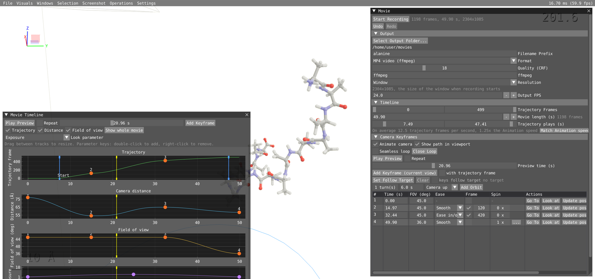
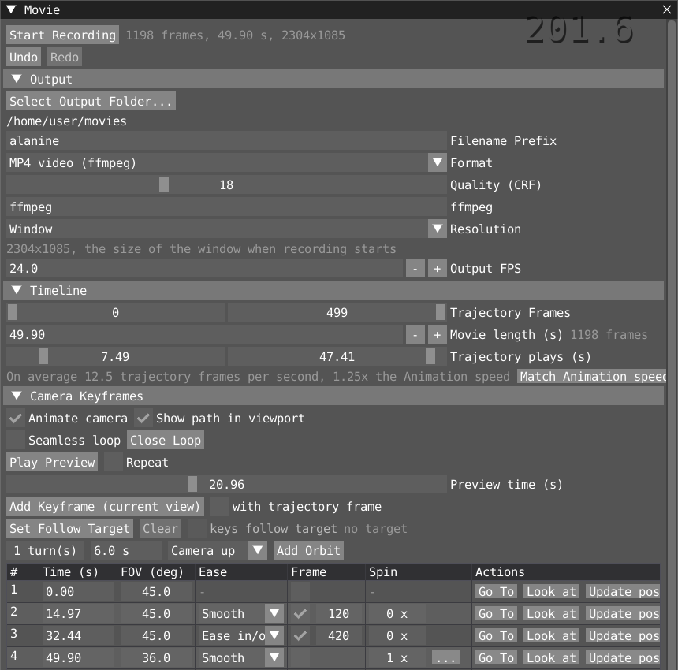
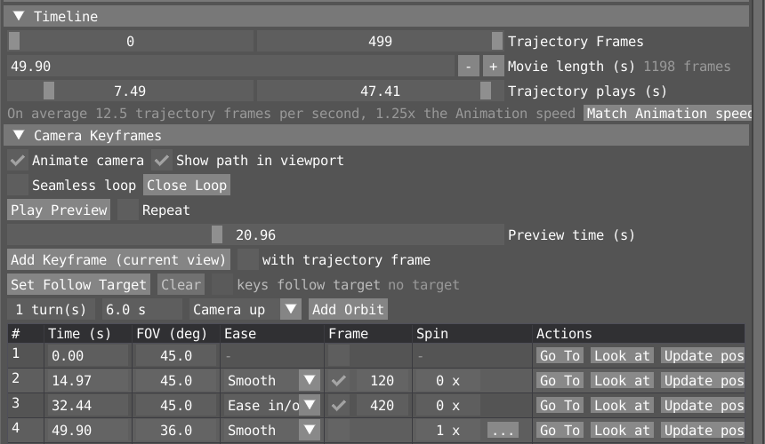
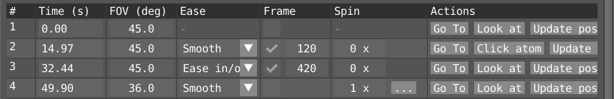
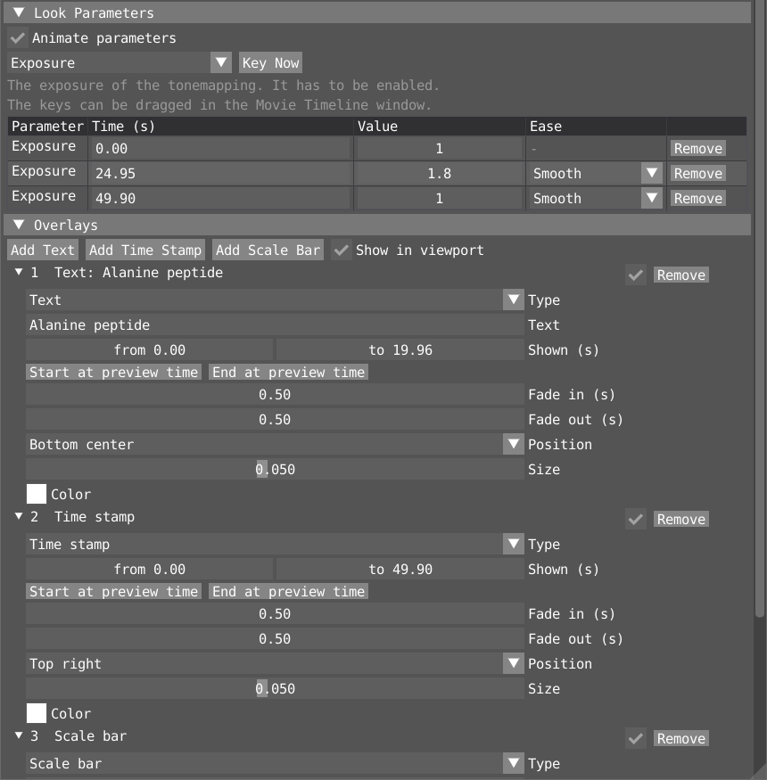
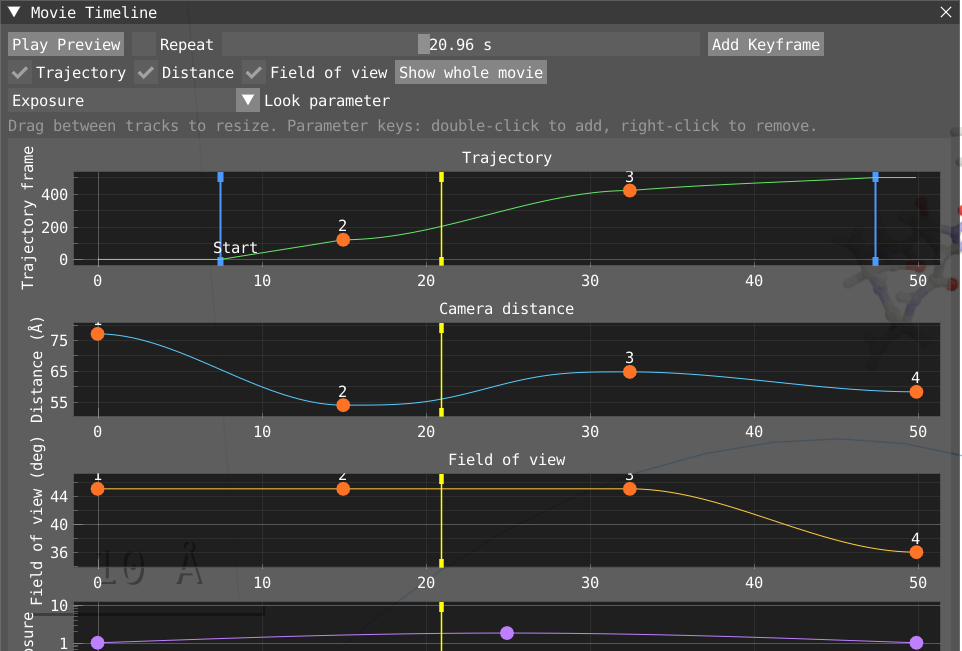

# Making movies

VIAMD can record a movie of a trajectory. You set how long the movie is, and you can place camera keyframes, key look parameters (exposure, background and so on) and the properties of representations (show or hide one, change its size or color), and add overlays (text, a time stamp, a scale bar, the VIAMD logo). The result is an MP4 file (H.264 or H.265) or a WebM file, encoded by ffmpeg, or a numbered PNG sequence.

There are two windows, both opened from the **Windows** menu:

- **Movie**: all the settings, the keyframe table and the record button.
- **Movie Timeline**: curves of the trajectory frame, camera distance, field of view and one look parameter over time. Here you can drag keys and scrub. It is closed when VIAMD starts and when a workspace is loaded.

## Quick start

1. Load a trajectory and open **Windows > Movie**.
2. Under **Output**, click **Select Output Folder...** and pick a format.
3. Set **Movie length (s)** and press Enter. At first the trajectory fills the whole movie.
4. Move **Preview time (s)** to 0, set up the view, and press **K** (or **Add Keyframe (current view)**).
5. Move the preview time, set up another view, and press **K** again. Repeat as needed.
6. Tick **Animate camera** and press **Play Preview** to watch the movie in the viewport.
7. Press **Start Recording**. Press **Esc** or **Stop Recording** to stop early.

When the recording is done, your own view, the animation playback and the screenshot settings are put back as they were.

## The Movie window

The top line has **Start Recording**, with a summary of what will be written: frames, seconds and pixel size. **Undo** and **Redo** (Ctrl+Z, Ctrl+Y / Ctrl+Shift+Z) apply to everything on the movie's timeline: camera keys, look parameter keys, overlays, the movie length and the trajectory timing.

### Output

| Setting | What it does |
|---|---|
| **Select Output Folder...** | Where the movie is written. Recording is disabled until one is chosen. |
| **Filename Prefix** | The file name: `prefix.mp4`, or `prefix_00000.png`, `prefix_00001.png`, ... |
| **Format** | **MP4 video, H.264 (ffmpeg)**, **MP4 video, H.265 (ffmpeg)** and **WebM video, VP9 (ffmpeg)** pipe the frames straight into ffmpeg, so no image files are written (ffmpeg needs libx264, libx265 or libvpx-vp9 for the one you pick). H.265 files are usually noticeably smaller than H.264 at a similar look and are tagged so that QuickTime plays them. **PNG sequence** writes one image per frame. |
| **Quality (CRF)** | Video formats only. Constant rate factor: lower is better and larger. H.264: 18 is close to lossless, 23 is the default. H.265: a value 4 to 6 higher looks the same (default 28). VP9: 15 to 35 is the usual range (default 32, up to 63). |
| **ffmpeg** | MP4 only. The ffmpeg executable. A bare name is looked up on the PATH. |
| **Copy ffmpeg command** | PNG only. Copies a command that encodes the PNG sequence into an MP4. |
| **Resolution** | **Window** (the window size when recording starts), Full HD, Quad HD, 4K, 8K or **Custom** (**Res X**, **Res Y**). |
| **Output FPS** | Frames per second of the movie. The number of frames is length × FPS. |
| **Scale** | The size of the frames as a part of the size above (100, 75, 50 or 25 %). A small one renders much faster: use it to check a movie before making it in full. |
| **Samples per frame** | With temporal anti-aliasing on: how many rendered images are averaged into each frame. 0 uses the length of the jitter sequence. Fewer is faster, more is smoother. |
| **Render only a range** | Renders the frames between two times of the movie (**Range (s)**), e.g. to redo a part of it. With a PNG sequence the files keep the numbers they have in the whole movie, so they can replace the old ones. **Start at preview time** and **End at preview time** take the times from the playhead. |
| **Save a workspace copy with the movie** | Writes `prefix.via` next to the movie, with the camera path, looks, overlays and settings it was made from. Opening it and recording again gives the same movie. |

While recording, **Pause** stops the recording where it is and **Resume** carries on. The progress bar shows how many frames are done and, after a few frames, about how long is left.

### Timeline: how long the movie is and how the trajectory plays

- **Trajectory Frames**: the first and last trajectory frame used. If the start is after the end, the trajectory plays backwards.
- **Movie length (s)**: the length of the whole movie, applied when you press Enter. **Everything on the timeline is scaled with it**: camera keys, look parameter keys, overlays and their fades, and when the trajectory starts and ends. The movie keeps its shape and only becomes faster or slower. Frame numbers and spin counts are not changed.
- **Trajectory plays (s)**: when, in movie time, the trajectory is at its first and at its last frame. Before the start the trajectory is held on its first frame, for example to fly over the structure first. After the end it is held on its last frame. These two points are the blue **Start** and **End** lines in the Movie Timeline, where they can also be dragged.
- The grey line below shows the average speed, in trajectory frames per second and compared with the Animation window's speed. **Match Animation speed** changes the movie length so the trajectory plays at the Animation window's speed.

To make the trajectory play faster or slower in parts of the movie, pin frames on camera keyframes (see **Frame** below). Between two pinned frames the trajectory plays at whatever speed is needed to get from one to the other. A pinned frame before the Start line or after the End line moves that line out to it.

### Camera keyframes

A keyframe is a camera (where the eye is, where it looks, its distance and its field of view) at a time in the movie. Between keyframes the camera moves smoothly. Before the first and after the last keyframe it holds still.

- **Animate camera**: while previewing or recording, the camera follows the keyframes. When it is off, the camera stays where you leave it and only the trajectory plays.
- **Show path in viewport**: draws the path of the eye (blue), the path of the look-at point (yellow), a camera at each keyframe, and a green camera at the preview time. With keys that follow a target or an atom, the path is the one the camera takes as the target moves through the trajectory: it is computed a few points at a time (the trajectory frames have to be read), so it appears from the start and grows for a moment, and the old path stays until the new one is done.
- **Seamless loop** and **Close Loop**: makes the camera path cyclic, so a movie played on repeat has no jump. **Close Loop** adds a final key in the first key's pose and turns the loop on.
- **Play Preview**, **Repeat** and **Preview time (s)**: play or scrub the movie in the viewport at its real speed, without recording.
- **Add Keyframe (current view)** (shortcut **K** while a movie window is open): adds a key of the current view at the preview time. A key at the same time is replaced. Tick **with trajectory frame** to also pin the trajectory frame shown now.
- **Key on Selection**: adds a key at the preview time that frames the selected atoms, seen from the direction the camera has now, and moves the viewport there. Molecules split by the periodic cell are framed as one.
- **Add Orbit**: the three fields before it set the number of turns, the duration and the axis (**Camera up**, **World X/Y/Z**). It adds a key at the preview time and another one *duration* later, where the camera has gone round the look-at point that many times. It is refused if the orbit would run past the end of the movie.

#### The keyframe table

The columns can be resized by dragging their borders. When they are wider than the window the table scrolls sideways.

| Column | Meaning |
|---|---|
| **#** | The key's number. Drag it onto another row to move the key's pose there; the times stay in place. |
| **Time (s)** | When in the movie. The list re-sorts when you finish editing. |
| **FOV (deg)** | Field of view. Narrow it to zoom in without moving the camera. |
| **Ease** | How the movie gets *to* this key from the previous one. **Smooth** passes through without stopping, **Ease in/out** slows down at both ends, **Linear** moves at constant speed, **Hold** stays put and then jumps. |
| **Frame** | Tick to pin a trajectory frame to this key, then drag the number. Pins control the trajectory's speed (see above). A frame lower than the previous pin plays backwards. |
| **Spin** | Extra whole turns around the look-at point on the way to this key. **...** opens the axis and a **Constant speed** option. |
| **Go To** | Moves the viewport to this key. Clicking a key's orange marker in the **Timelines** window does the same. |
| **Look at** | Click it, then click an atom in the viewport. The key now looks at that atom and **tracks it through the trajectory**. While picking, the button reads **Click atom**; press Esc to cancel. |
| **Update position** | Moves the key's eye to where the viewport camera is now, still looking at the same point. The field of view and, if pinned, the frame are taken too. |
| **Follow** / **Unfollow** | Makes the key look at a point that moves with the follow target (see below), kept where it is relative to the target now. Press **Go To** first, so that the trajectory is at the frame of the key. **Unfollow** makes it fixed again. |
| **Dup** | Copies the key to one second later. |
| **Copy** | Remembers the key. **Paste Keyframe** (above the table) puts it in at the preview time, replacing a key that is there. **Ctrl+C** copies the key at the preview time and **Ctrl+V** pastes, while a movie window is open. |
| **Remove** | Removes the key. |

So, to edit a keyframe: **Go To** it, move around, press **Update position** to set where the eye is, and use **Look at** to choose what it looks at. Below the table, a line shows the eye, the look-at point and the distance at the preview time, plus the focus distance when depth of field is on.

#### Follow target

**Set Follow Target** uses the current selection as a target. With **keys follow target** ticked, new keyframes look at a point that moves with the centre of the target, so a drifting molecule stays in view. Between a following key and a fixed key the camera blends from one to the other. **Look at** on a single key is the per-key version of this, tracking one atom.

### Look parameters

Some visual settings can change during the movie: background color and intensity, ambient occlusion and its radius, exposure, depth of field blur, near and far clipping planes, and focus distance.

1. Pick the parameter in the list.
2. Set it up as it should look, in **Visuals**, at some preview time.
3. Press **Key Now**.

The table lists the keys, with their time, value, ease and **Remove**. With **Animate parameters** ticked, the keys are followed when scrubbing, previewing and recording. When the recording ends, the parameters go back to what they were.

### Representations

The properties of a representation can be keyed too, to show or hide it at some time or to change its size or look:

- **Visible**: shown or hidden. A representation cannot fade (the solid ones have no transparency), so it grows in or shrinks away instead: at a key it starts to go to its new state, taking **Transition (s)** seconds (2 by default, set above the table; 0 makes it appear and vanish at once). Its sizes are scaled during that time and it is hidden when it reaches zero. Key it once when it should appear and once when it should go. Keys closer together than the transition make it turn around from where it was. The timeline lane shows the ramps. A representation of the electronic structure or a dipole cannot be scaled, so it is shown fully until the transition ends and then vanishes.
- The scales of the representation (**Radius scale**, **Ball scale** and **Bond scale**, **Width**, **Coil** and so on, whatever its type has), **Tint scale** and **Saturation**. These move smoothly between keys, with the same **Ease** choices as other keys.
- **Base color** (seen where the colour mapping is Uniform) and **Tint color** (seen where **Tint scale** is above zero). Colors are edited in the table; in the timeline lane their keys are squares in their color that can be dragged in time.

Pick the representation and the property, set it up in the **Representations** window as it should be at the preview time (the eye shows or hides it), and press **Key Now**. The table lists the keys. A key belongs to a representation by an id that stays with it when representations are moved, duplicated or removed, and is saved in the workspace; removing a representation removes its keys. **Animate parameters** switches them on and off together with the look parameters, and the values go back to what they were when the keys let go or the recording ends. The **Representations** window is locked while recording, because the frames are made from the representations as they are.

Changing tint or saturation recolors the atoms of that representation every frame, which is slow for very large systems. Scales and visibility are cheap.

### Depth of field

Under **Visuals > Depth of Field**, **Focus** chooses what is sharp:

- **Look-at point**: what the camera looks at. This is the default and follows the keyframes.
- **Distance**: a fixed distance from the camera (**Focus distance**, **From view** takes the current distance). Key **Focus distance** as a look parameter to pull focus during the movie.
- **Follow target**: the centre of the movie's follow target, even when the camera looks elsewhere.

### Overlays

**Add Text**, **Add Time Stamp**, **Add Scale Bar**, **Add Time Bar**, **Add Timeline**, **Add Distribution**, **Add Property**, **Add Logo** and **Add Image...** add overlays that are drawn into the recorded frames. A new movie starts with the VIAMD logo in the top left corner, for the whole movie: remove it with its **Remove** button if you do not want it (a saved workspace remembers that). The logo is black and white lettering with colour on its molecule, so on a dark background give it a **Background** plate or tint it with its **Color**. **Add Time Bar** adds a bar that shows how far the trajectory has gone. It fills from left to right whichever way the trajectory is played: a trajectory played backward still fills it forward. It fills fast where the trajectory is played fast, slowly where it is slowed down and not at all where it is held, so it shows the pace. **Width** is a part of the width of the frame and **Size** is the height of its text. **Time that has gone** writes the trajectory time covered so far over the whole (in the unit of the timeline), and **Speed** how fast it plays as a multiple of the speed of the Animation panel (x1.0 is as there). The time stamp, on the other hand, shows the time of the frame that is shown, so it counts back when the trajectory goes backward.

**Add Timeline** draws a subplot of the Timelines window into the movie, and **Add Distribution** one of the Distributions window. Choose the subplot in the overlay (the series are the ones that are in it, in their colours there, at most six). The plot is drawn as the movie plays: with **As the movie plays** on, a timeline grows with the part of the trajectory that has been played (backward too: it grows to the left), and a distribution is counted over the frames that have been played, so its bars grow to the shape of the whole. A thin line marks the frame that is shown, and with **Value** the legend shows the value at that frame, in the unit of the plot. With it off the whole plot is shown. **Width** is a part of the width of the frame and **Size** the height of the plot, the text follows it. A distribution of a script that is not over frames (an RDF, say) is drawn as it is. The background plate is on by default, for readability. Only the first member of a population is drawn.

**Add Property** shows the visualization of a script property in the viewport, the atoms, the geometry and the labels that hovering its plot shows, while the overlay is shown. Type the identifier of the property or pick it from the script. It is in the recording too, with its labels. It needs the script to have evaluated the property.

**Add Image...** asks for a png or jpg file (a group's logo, a figure) and shows it like the logo; **Size** is its height and its transparency is kept. The file is saved in the workspace as a path relative to it, so keep it with the workspace; **Reload** reads it again after it was changed, and the box turns red when it cannot be read. For a logo or an image, **Size** is its height. Each overlay has:

- an on/off box and **Remove**;
- **Shown (s)**, the times it is shown from and to, with **Start at preview time** and **End at preview time**;
- **Fade in (s)** and **Fade out (s)**;
- a **Position** (nine anchors), **Size** (a part of the frame height, or in points: a point is a pixel of a frame that is 1080 pixels high, scaled with the frame, so a size looks the same at any resolution; changing the unit keeps the size as it is), **Color** and a **Background** plate to read it over a busy picture (none while its opacity is 0).

A scale bar picks a round length unless you set one. **Show in viewport** previews the overlays at the preview time. Their placement is exact only when the viewport has the same proportions as the movie.

## The Movie Timeline window

Open it with **Windows > Movie Timeline**. Its top line has **Play Preview**, **Repeat**, a playhead slider and **Add Keyframe**. Below are aligned tracks with real axes, which share the time axis:

- **Trajectory**: the trajectory frame shown at each moment. The blue **Start** and **End** lines are when the trajectory starts and stops; drag them. Orange dots are keys with a pinned frame: drag sideways to change the time and up or down to change the frame.
- **Camera distance**: how far the camera is from what it looks at, in your preferred length unit. Dots can be dragged sideways (time only).
- **Field of view** in degrees. Dots can be dragged sideways (time only).
- **Look parameter**: the parameter chosen in the **Look parameter** list at the top. Double-click to add a key, drag to change it, right-click to remove it.
- **Representation lane**: the property of a representation chosen with the two lists next to **Representation lane** (untick it to hide the lane). The line is its value over the movie and the dots are its keys: drag sideways for the time and up or down for the value, double-click to add one, right-click to remove one. For **Visible** a double-click turns it around at that time (shown becomes hidden and the other way), and the first one on a representation without keys also keys what it is now at time 0, so that it holds until then.

The yellow line is the playhead. Scroll to zoom the time, drag the background to pan, and use **Show whole movie** to reset. Drag between tracks to change their heights. Untick **Trajectory**, **Distance** or **Field of view** to hide a track. With **Snap to frames** ticked (the default), keys, the playhead and the trajectory's start and end that you drag, and keys added at the preview time, land on a frame of the movie (at the **Output FPS**), so a change happens on a frame and not between two.

## Saving

The movie (length, trajectory timing, camera keys including what they look at, look parameter keys, representation keys, overlays and follow target) is saved in the workspace (`.via`) under `[Movie]`. Workspaces from earlier versions load and are converted.

## Example workspace

[`examples/aspirin_phospholipase_movie.via`](examples/aspirin_phospholipase_movie.via) is a finished movie of aspirin in phospholipase (80 s): camera keys that look at and track atoms, a depth of field pull, representation keys (water appears when the camera reaches the ligand, residues are shown for a while, the protein fades to grey, the ligand shrinks as the camera comes in), a title, a time stamp and a scale bar. It is kept as a worked example of the features here and is updated when they grow.

It refers to `aspirin-phospholipase.gro` and `.xtc` in its own folder, which are not part of the repository. Put your copy of the two files next to the workspace, then **File > Open Workspace**, and scrub **Preview time**.

## Tips

- Plan the length first, then place keys. If the movie is too fast or too slow, change **Movie length** and everything stays in proportion.
- For a fly-over before the dynamics start, drag the blue **Start** line to the right. The trajectory waits on its first frame until then.
- To slow down an interesting event, pin frames on two keys around it and move them further apart in time.
- **Smooth** keys never stop the camera. Use **Ease in/out** or **Hold** where the camera should rest.
- PNG sequences are safest for very long or very large movies. Encode them afterwards with **Copy ffmpeg command**.
- Check the motion at **Scale** 25 % and with few **Samples per frame** first, then make the final movie at full size. To fix one part afterwards, use **Render only a range** with a PNG sequence and replace the files.

## Known limits

- **Follow target** depth of field uses the global follow target, not a key's own **Look at** atom.
- Distance and field of view are edited in the table and the viewport. In the timeline their dots only move in time.
- Solid representations cannot fade: they grow in and shrink away instead (see **Representations**).
- The Representations window is locked while recording.
